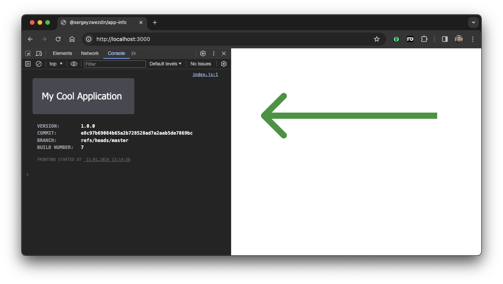
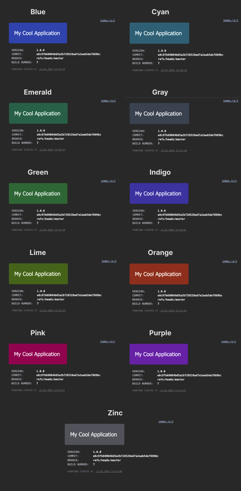

# @relab/app-info

Utility to display app info in browser console.

**Features**
- 
- 🚀 Zero dependencies
- 🌓 Dark/light mode support
- 💡 Multiple theme support
- 💥 Works in SSR environment



## Usage

1. `npm install --save @relab/app-info`
2. Add `displayAppInfo()` at the start of your app
```typescript
displayAppInfo('My Cool Application', {
    Version: '1.0.0',
    Commit: 'e8c97b69084b65a2b728528ad7a2aab5de7869bc',
    Branch: 'refs/heads/master',
    'Build Number': '7'
})
```

## Options

- `theme` - one of predefined theme, supported options are: `Blue`, `Cyan`, `Emerald`, `Gray`, `Green`, `Indigo`, `Lime`, `Orange`, `Pink`, `Purple`, `Zinc` (default: `Zinc`)
- `printStartTime` - whether to print application start time (default: `true`)

```typescript
displayAppInfo('My Cool Application', {
    Version: '1.0.0',
    Commit: 'e8c97b69084b65a2b728528ad7a2aab5de7869bc',
    Branch: 'refs/heads/master',
    'Build Number': '7'
}, {
    printStartTime: false,
    theme: 'Indigo'
})
```

## Themes



## License

Released under [MIT](/LICENSE) by [Sergey Zwezdin](https://github.com/sergeyzwezdin).
